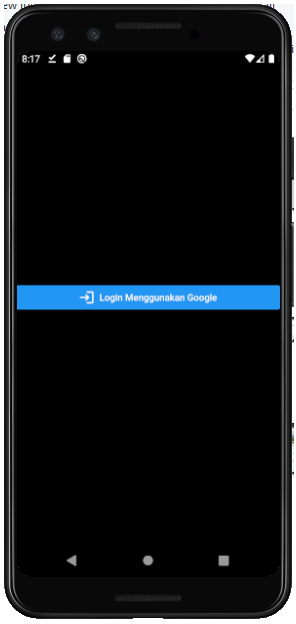
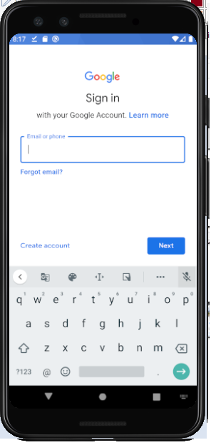
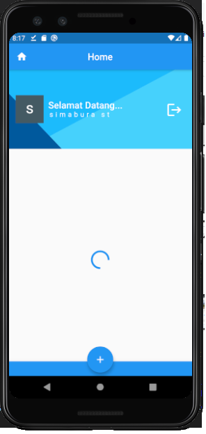
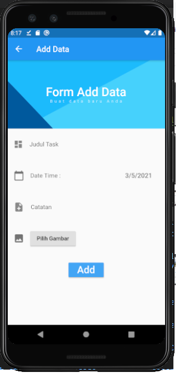

# Daily App

A First Flutter project.
Daily App, mencatat setiap kegiatan anda secara live.
Menyimpan data langsung ke Firebase,
Penggunaan mudah dan sangat nyaman

This Project included features=

- Google Auth
- CRUD Firebase
- Image upload

Plugin/Dependencies req:

- ImagePicker
- google_sign_in
- firebase_auth
- firebase_storage
- cloud_firestore

## Getting Started

This project is a starting point for a Flutter application.

A few resources to get you started if this is your first Flutter project:

- [Lab: Write your first Flutter app](https://flutter.dev/docs/get-started/codelab)
- [Cookbook: Useful Flutter samples](https://flutter.dev/docs/cookbook)

For help getting started with Flutter, view our
[online documentation](https://flutter.dev/docs), which offers tutorials,
samples, guidance on mobile development, and a full API reference.

## ScreenShot

Login

Google Auth

Home

Create Data

## Contributing

1. Fork it (<https://github.com/yourname/yourproject/fork>)
2. Create your feature branch (`git checkout -b feature/fooBar`)
3. Commit your changes (`git commit -am 'Add some fooBar'`)
4. Push to the branch (`git push origin feature/fooBar`)
5. Create a new Pull Request
